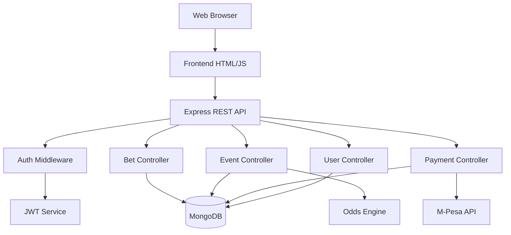

# Design Document: Betting Platform

## Overview

The betting platform is a full-stack web application built with a Node.js/Express backend and a responsive HTML/CSS/JavaScript frontend. The system uses MongoDB for data persistence, integrates with M-Pesa for payments, and provides real-time odds updates. The architecture follows a RESTful API design pattern with JWT-based authentication and role-based access control.

The platform consists of three main user interfaces:
1. **Public Website**: Event browsing, bet placement, account management
2. **Admin Dashboard**: Event management, odds control, user oversight
3. **API Layer**: RESTful endpoints for all operations

## Architecture

### System Components



### Technology Stack

**Backend:**
- Node.js with Express.js framework
- MongoDB with Mongoose ODM
- JWT for authentication
- Bcrypt for password hashing
- M-Pesa Daraja API for payments

**Frontend:**
- HTML5, CSS3, JavaScript (ES6+)
- Responsive design with mobile-first approach
- Real-time updates using polling or WebSockets

**Infrastructure:**
- MongoDB Atlas for database hosting
- Environment variables for configuration
- HTTPS for secure communication

## Components and Interfaces

### 1. User Model

```javascript
{
  _id: ObjectId,
  name: String,
  email: String (unique, indexed),
  phone: String (unique, indexed),
  password: String (hashed),
  role: String (enum: ['user', 'admin']),
  balance: Number (default: 0),
  limits: {
    dailyDeposit: Number,
    weeklyDeposit: Number,
    monthlyDeposit: Number,
    dailyLoss: Number,
    weeklyLoss: Number,
    monthlyLoss: Number
  },
  selfExcluded: Boolean,
  selfExclusionEnd: Date,
  createdAt: Date,
  updatedAt: Date
}
```

### 2. Event Model

```javascript
{
  _id: ObjectId,
  sport: String (enum: ['football', 'basketball', 'tennis', 'other']),
  homeTeam: String,
  awayTeam: String,
  scheduledTime: Date,
  status: String (enum: ['upcoming', 'live', 'completed', 'cancelled']),
  markets: [{
    name: String,
    outcomes: [{
      name: String,
      odds: Number,
      isActive: Boolean
    }]
  }],
  result: {
    winner: String,
    score: String
  },
  createdAt: Date,
  updatedAt: Date
}
```

### 3. Bet Model

```javascript
{
  _id: ObjectId,
  userId: ObjectId (ref: 'User'),
  eventId: ObjectId (ref: 'Event'),
  market: String,
  outcome: String,
  odds: Number,
  stake: Number,
  potentialWinnings: Number,
  status: String (enum: ['pending', 'won', 'lost', 'void']),
  placedAt: Date,
  settledAt: Date,
  createdAt: Date,
  updatedAt: Date
}
```

### 4. Transaction Model

```javascript
{
  _id: ObjectId,
  userId: ObjectId (ref: 'User'),
  type: String (enum: ['deposit', 'withdrawal', 'bet_stake', 'bet_winnings', 'refund']),
  amount: Number,
  balanceBefore: Number,
  balanceAfter: Number,
  status: String (enum: ['pending', 'completed', 'failed']),
  mpesaTransactionId: String,
  mpesaReceiptNumber: String,
  description: String,
  createdAt: Date,
  updatedAt: Date
}
```

### 5. API Endpoints

#### Authentication Endpoints
- `POST /api/auth/register` - Register new user
- `POST /api/auth/login` - User login
- `POST /api/auth/forgot-password` - Request password reset
- `POST /api/auth/reset-password` - Reset password with token

#### User Endpoints
- `GET /api/users/profile` - Get user profile (authenticated)
- `PUT /api/users/profile` - Update user profile (authenticated)
- `GET /api/users/balance` - Get current balance (authenticated)
- `GET /api/users/transactions` - Get transaction history (authenticated)
- `PUT /api/users/limits` - Set betting limits (authenticated)

#### Event Endpoints
- `GET /api/events` - Get all events (with filters: sport, status)
- `GET /api/events/:id` - Get single event details
- `POST /api/events` - Create event (admin only)
- `PUT /api/events/:id` - Update event (admin only)
- `DELETE /api/events/:id` - Delete event (admin only)
- `PUT /api/events/:id/odds` - Update odds (admin only)

#### Bet Endpoints
- `POST /api/bets` - Place a bet (authenticated)
- `GET /api/bets` - Get user's bets (authenticated)
- `GET /api/bets/:id` - Get bet details (authenticated)
- `POST /api/bets/:id/settle` - Settle bet (admin only)

#### Payment Endpoints
- `POST /api/payments/deposit` - Initiate M-Pesa deposit (authenticated)
- `POST /api/payments/mpesa-callback` - M-Pesa callback handler
- `POST /api/payments/withdraw` - Request withdrawal (authenticated)
- `GET /api/payments/transactions` - Get payment history (authenticated)

#### Admin Endpoints
- `GET /api/admin/stats` - Get platform statistics (admin only)
- `GET /api/admin/users` - Get all users (admin only)
- `PUT /api/admin/users/:id` - Update user account (admin only)
- `GET /api/admin/bets` - Get all bets (admin only)
- `POST /api/admin/withdrawals/:id/approve` - Approve withdrawal (admin only)

### 6. Authentication Middleware

```javascript
// JWT verification middleware
function authenticateToken(req, res, next) {
  // Extract token from Authorization header
  // Verify token using JWT secret
  // Attach user data to req.user
  // Call next() or return 401 Unauthorized
}

// Admin role verification
function requireAdmin(req, res, next) {
  // Check if req.user.role === 'admin'
  // Call next() or return 403 Forbidden
}
```

### 7. M-Pesa Integration Service

```javascript
class MPesaService {
  // Generate OAuth token
  async getAccessToken()
  
  // Initiate STK Push for deposit
  async initiateSTKPush(phoneNumber, amount, accountReference)
  
  // Process callback from M-Pesa
  async handleCallback(callbackData)
  
  // Initiate B2C payment for withdrawal
  async initiateB2C(phoneNumber, amount, remarks)
  
  // Query transaction status
  async queryTransactionStatus(checkoutRequestID)
}
```

## Data Models

### User Balance Management

User balance is tracked with atomic operations to prevent race conditions:

```javascript
// Deposit operation
await User.findByIdAndUpdate(
  userId,
  { $inc: { balance: amount } },
  { new: true, session }
);

// Bet placement (deduct stake)
await User.findByIdAndUpdate(
  userId,
  { $inc: { balance: -stake } },
  { new: true, session }
);

// Winning payout
await User.findByIdAndUpdate(
  userId,
  { $inc: { balance: winnings } },
  { new: true, session }
);
```

### Transaction Logging

All balance changes are logged in the Transaction model for audit purposes:

```javascript
await Transaction.create({
  userId,
  type: 'deposit',
  amount,
  balanceBefore: user.balance,
  balanceAfter: user.balance + amount,
  status: 'completed',
  mpesaTransactionId,
  description: 'M-Pesa deposit'
});
```

### Bet Settlement Logic

```javascript
async function settleBet(betId, eventResult) {
  const bet = await Bet.findById(betId);
  const event = await Event.findById(bet.eventId);
  
  // Determine if bet won
  const isWinner = determineWinner(bet, eventResult);
  
  if (isWinner) {
    // Update user balance with winnings
    await User.findByIdAndUpdate(
      bet.userId,
      { $inc: { balance: bet.potentialWinnings } }
    );
    
    // Log transaction
    await Transaction.create({
      userId: bet.userId,
      type: 'bet_winnings',
      amount: bet.potentialWinnings,
      description: `Winnings from bet ${betId}`
    });
    
    // Update bet status
    bet.status = 'won';
  } else {
    bet.status = 'lost';
  }
  
  bet.settledAt = new Date();
  await bet.save();
}
```

## Error Handling

### Error Response Format

All API errors follow a consistent format:

```javascript
{
  success: false,
  error: {
    code: 'ERROR_CODE',
    message: 'Human-readable error message',
    details: {} // Optional additional context
  }
}
```

### Error Categories

1. **Authentication Errors** (401)
   - Invalid credentials
   - Expired token
   - Missing token

2. **Authorization Errors** (403)
   - Insufficient permissions
   - Account suspended

3. **Validation Errors** (400)
   - Invalid input data
   - Missing required fields
   - Constraint violations

4. **Business Logic Errors** (400)
   - Insufficient balance
   - Event already started
   - Betting limit exceeded
   - Self-excluded user

5. **Not Found Errors** (404)
   - Resource not found

6. **Server Errors** (500)
   - Database errors
   - External API failures
   - Unexpected errors

### Error Handling Middleware

```javascript
function errorHandler(err, req, res, next) {
  console.error(err);
  
  if (err.name === 'ValidationError') {
    return res.status(400).json({
      success: false,
      error: {
        code: 'VALIDATION_ERROR',
        message: err.message
      }
    });
  }
  
  if (err.name === 'UnauthorizedError') {
    return res.status(401).json({
      success: false,
      error: {
        code: 'UNAUTHORIZED',
        message: 'Invalid or expired token'
      }
    });
  }
  
  // Default server error
  res.status(500).json({
    success: false,
    error: {
      code: 'INTERNAL_ERROR',
      message: 'An unexpected error occurred'
    }
  });
}
```


## Correctness Properties

A property is a characteristic or behavior that should hold true across all valid executions of a system—essentially, a formal statement about what the system should do. Properties serve as the bridge between human-readable specifications and machine-verifiable correctness guarantees.

### Property 1: Valid User Registration Creates Account

*For any* valid user registration data (name, email, phone, password meeting security requirements), registering the user should create a new account with a unique ID and hashed password.

**Validates: Requirements 1.1**

### Property 2: Password Security Requirements Enforcement

*For any* password string, the system should reject passwords that don't meet security requirements (less than 8 characters, no uppercase letter, or no number).

**Validates: Requirements 1.3**

### Property 3: Authentication Success with Valid Credentials

*For any* registered user, providing correct email and password should successfully authenticate and return a valid JWT token.

**Validates: Requirements 1.4**

### Property 4: Authentication Failure with Invalid Credentials

*For any* authentication attempt with incorrect password or non-existent email, the system should reject the login and return an error.

**Validates: Requirements 1.5**

### Property 5: Deposit Updates Balance Correctly

*For any* user and valid deposit amount, when a deposit is processed successfully, the user's balance should increase by exactly that amount and a transaction record should be created.

**Validates: Requirements 2.1, 2.2, 2.5**

### Property 6: Withdrawal Requires Sufficient Balance

*For any* withdrawal request, if the withdrawal amount exceeds the user's current balance, the system should reject the withdrawal.

**Validates: Requirements 2.3**

### Property 7: Withdrawal Deducts Balance Correctly

*For any* user with sufficient balance, when a withdrawal is approved, the user's balance should decrease by exactly the withdrawal amount and a transaction record should be created.

**Validates: Requirements 2.4, 2.5**

### Property 8: Balance Accuracy After Transactions

*For any* sequence of deposits, withdrawals, bets, and settlements, the user's displayed balance should equal the initial balance plus all deposits and winnings minus all withdrawals and stakes.

**Validates: Requirements 2.6**

### Property 9: Event Categorization by Sport

*For any* event with a sport type, filtering events by that sport type should include that event in the results.

**Validates: Requirements 3.4, 3.5**

### Property 10: Bet Slip Addition

*For any* event and outcome selection, adding it to the bet slip should make it appear in the user's bet slip with correct event and outcome details.

**Validates: Requirements 4.1**

### Property 11: Potential Winnings Calculation

*For any* stake amount and odds value, the calculated potential winnings should equal stake multiplied by odds.

**Validates: Requirements 4.2**

### Property 12: Bet Placement Requires Sufficient Balance

*For any* bet with a stake amount, if the stake exceeds the user's current balance, the system should reject the bet placement.

**Validates: Requirements 4.3**

### Property 13: Bet Placement Deducts Stake

*For any* successful bet placement, the user's balance should decrease by the stake amount, a unique bet ID should be generated, and the bet details should be stored.

**Validates: Requirements 4.4, 4.7**

### Property 14: Betting Prevented on Started Events

*For any* event with status 'live' or 'completed', attempting to place a bet on that event should be rejected.

**Validates: Requirements 4.6**

### Property 15: Bet Details Completeness

*For any* stored bet, retrieving its details should include event name, stake, odds, potential winnings, and timestamp.

**Validates: Requirements 5.3**

### Property 16: Bet Filtering by Criteria

*For any* bet filter criteria (date range, sport, status), the returned bets should only include bets matching all specified criteria.

**Validates: Requirements 5.4**

### Property 17: Winning Bet Settlement

*For any* bet on a concluded event where the bet's outcome matches the event's winning outcome, settling the bet should increase the user's balance by the potential winnings and mark the bet as 'won'.

**Validates: Requirements 6.1, 6.2, 6.6**

### Property 18: Losing Bet Settlement

*For any* bet on a concluded event where the bet's outcome does not match the event's winning outcome, settling the bet should not change the user's balance and should mark the bet as 'lost'.

**Validates: Requirements 6.3, 6.6**

### Property 19: Void Bet Refund

*For any* bet on an event that is cancelled or voided, settling the bet should refund the original stake to the user's balance and mark the bet as 'void'.

**Validates: Requirements 6.4, 6.6**

### Property 20: Admin Odds Modification

*For any* event and market, when an admin updates the odds for an outcome, the new odds value should be stored and reflected in subsequent retrievals.

**Validates: Requirements 7.3**

### Property 21: Platform Statistics Accuracy

*For any* set of bets and users, the calculated statistics (total bets count, active users count, total revenue) should match the actual counts and sums from the database.

**Validates: Requirements 7.4**

### Property 22: Manual Bet Settlement by Admin

*For any* bet, when an admin manually settles it as won, lost, or void, the bet status should update and the user balance should adjust accordingly (winnings for won, refund for void, no change for lost).

**Validates: Requirements 7.6**

### Property 23: Withdrawal Approval Updates Status

*For any* pending withdrawal, when an admin approves it, the withdrawal status should change to 'completed', and when rejected, it should change to 'failed' and refund the amount to the user balance.

**Validates: Requirements 7.7**

### Property 24: M-Pesa Callback Processing

*For any* valid M-Pesa callback with a successful payment status, processing the callback should update the user's balance, store the M-Pesa transaction ID, and mark the transaction as completed.

**Validates: Requirements 8.2, 8.5, 8.6**

### Property 25: Failed Payment Handling

*For any* M-Pesa callback with a failed payment status, processing the callback should not update the user's balance and should mark the transaction as failed.

**Validates: Requirements 8.3, 8.6**

### Property 26: Deposit Limit Enforcement

*For any* user with a daily deposit limit set, attempting to deposit an amount that would exceed the limit for the current day should be rejected.

**Validates: Requirements 9.2**

### Property 27: Loss Limit Enforcement

*For any* user with a loss limit set, when their losses for the period reach the limit, attempting to place a new bet should be rejected.

**Validates: Requirements 9.4**

### Property 28: Self-Exclusion Enforcement

*For any* user who is self-excluded with an exclusion end date in the future, attempting to login or place a bet should be rejected.

**Validates: Requirements 9.6**

### Property 29: Password Hashing

*For any* user account, the stored password should be a bcrypt hash (not plain text) and should verify correctly against the original password.

**Validates: Requirements 10.1**

### Property 30: JWT Token Expiration

*For any* generated JWT token, attempting to use it after 24 hours should result in authentication failure.

**Validates: Requirements 10.3**

### Property 31: Financial Transaction Logging

*For any* financial operation (deposit, withdrawal, bet placement, bet settlement), a transaction record should be created with timestamp, user ID, amount, and balance before/after.

**Validates: Requirements 10.4**

### Property 32: Input Validation and Sanitization

*For any* user input containing special characters or SQL/NoSQL injection patterns, the system should either reject the input or sanitize it before processing.

**Validates: Requirements 10.5**

## Testing Strategy

### Dual Testing Approach

The betting platform will use both unit tests and property-based tests to ensure comprehensive coverage:

**Unit Tests** will verify:
- Specific examples of user registration, login, and password reset flows
- Edge cases like duplicate email registration, empty inputs, boundary values
- Integration between components (API endpoints, database operations, M-Pesa callbacks)
- Error conditions and error message formatting
- Admin dashboard operations

**Property-Based Tests** will verify:
- Universal properties across all valid inputs using randomized test data
- Balance calculations remain accurate across sequences of operations
- Bet settlement logic works correctly for all possible outcomes
- Authentication and authorization work for all user types
- Input validation catches all malicious patterns

### Property-Based Testing Configuration

We will use **fast-check** (for JavaScript/Node.js) as our property-based testing library.

Each property test will:
- Run a minimum of 100 iterations with randomized inputs
- Reference its corresponding design document property
- Use the tag format: **Feature: betting-platform, Property N: [property description]**

### Test Organization

```
backend/
  tests/
    unit/
      auth.test.js          # Authentication unit tests
      bets.test.js          # Bet placement unit tests
      payments.test.js      # Payment processing unit tests
      events.test.js        # Event management unit tests
      admin.test.js         # Admin operations unit tests
    
    properties/
      auth.properties.test.js       # Properties 1-4
      balance.properties.test.js    # Properties 5-8
      events.properties.test.js     # Properties 9
      bets.properties.test.js       # Properties 10-16
      settlement.properties.test.js # Properties 17-19
      admin.properties.test.js      # Properties 20-23
      payments.properties.test.js   # Properties 24-25
      limits.properties.test.js     # Properties 26-28
      security.properties.test.js   # Properties 29-32
```

### Test Data Generators

Property tests will use custom generators for:
- Valid user data (names, emails, phone numbers, passwords)
- Valid and invalid passwords (for security testing)
- Deposit and withdrawal amounts (positive numbers within reasonable ranges)
- Bet stakes and odds (positive numbers)
- Event data (teams, sports, scheduled times)
- Transaction sequences (deposits, bets, settlements)
- M-Pesa callback payloads (successful and failed)

### Integration Testing

Integration tests will verify:
- Complete user registration and login flow
- End-to-end bet placement and settlement
- M-Pesa deposit and withdrawal flows (using mock M-Pesa API)
- Admin dashboard operations affecting user accounts
- Responsible gambling limit enforcement across multiple operations

### Testing Best Practices

1. **Isolation**: Each test should be independent and not rely on other tests
2. **Database Cleanup**: Use test database and clean up after each test
3. **Mocking External APIs**: Mock M-Pesa API calls to avoid external dependencies
4. **Realistic Data**: Use realistic test data that mirrors production scenarios
5. **Error Testing**: Test both success and failure paths
6. **Performance**: Property tests should complete within reasonable time (< 5 seconds per property)
7. **Coverage**: Aim for >80% code coverage with combination of unit and property tests
